<div align="center">
  
</div>

# Seja bem vindo ao Orçamento Simples 👋

Uma ferramenta simples e produtiva desenvolvida para ser o seu aliado, e ajudar a gerenciar melhor suas finanças pessoais de forma prática e conveniente!

<div align="left">
  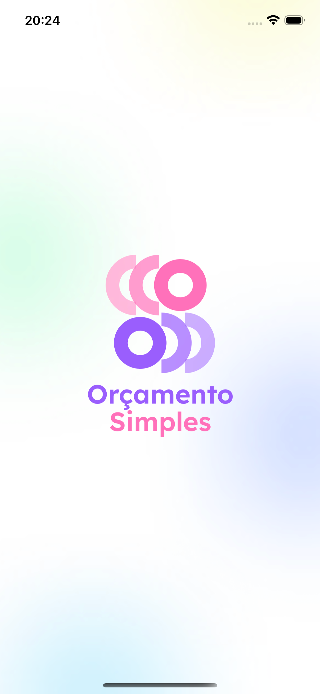
  
  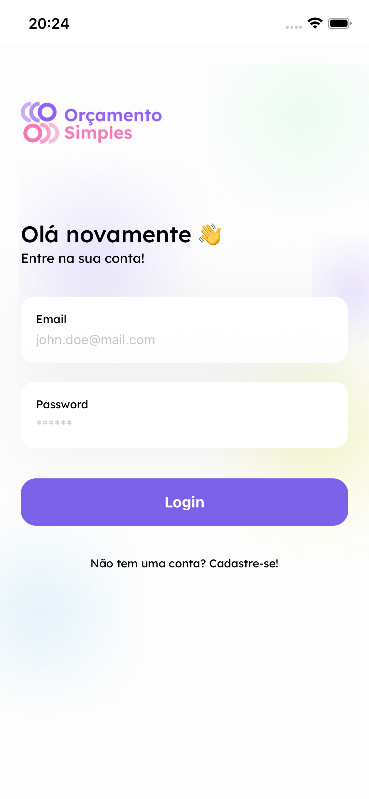
  
  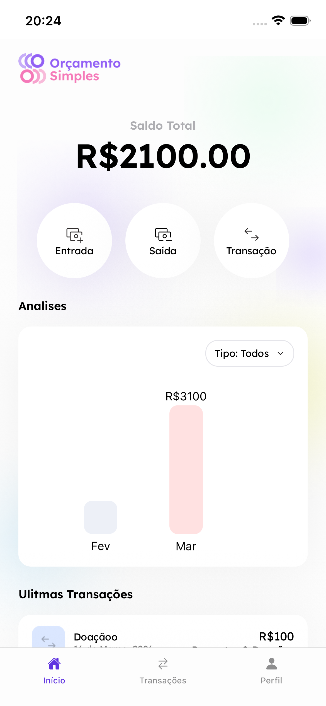
</div>
<div align="left">
  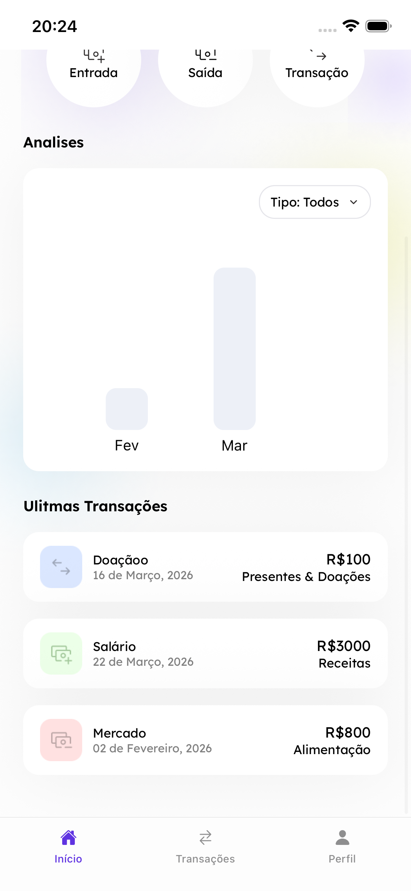
  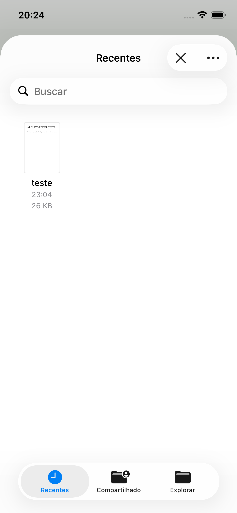
  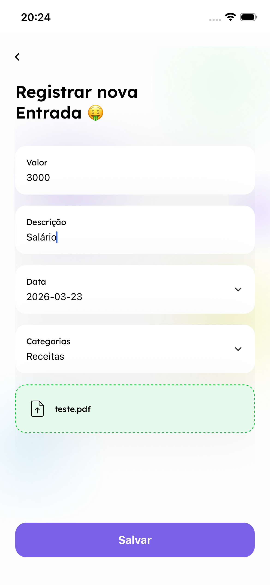
  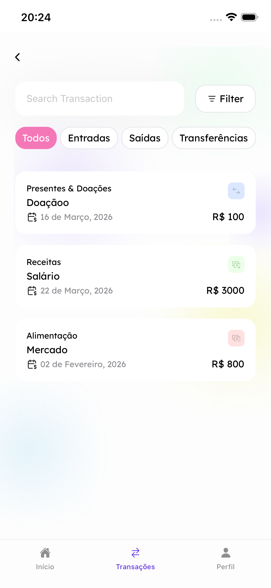
  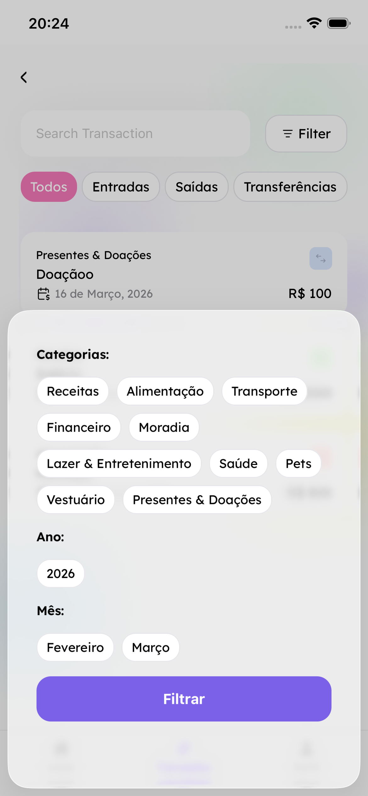
</div>
<div align="left">
  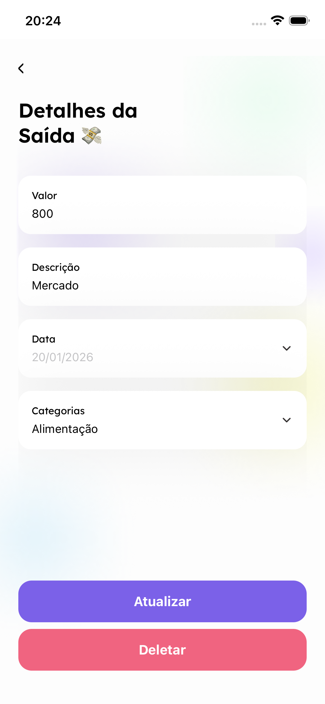
  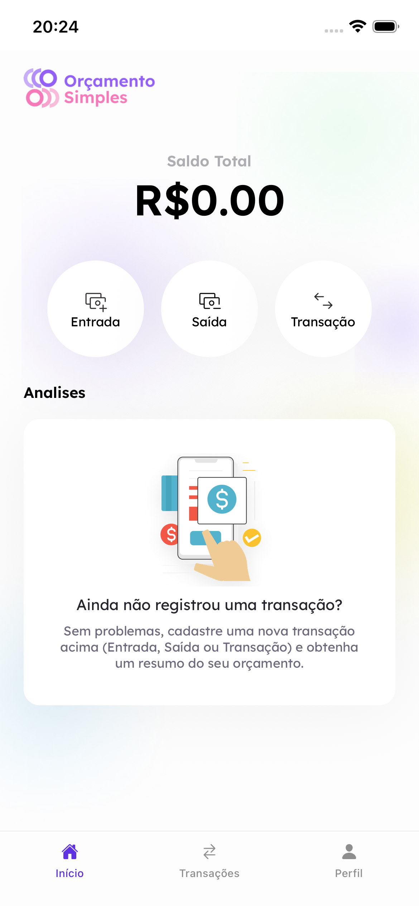
  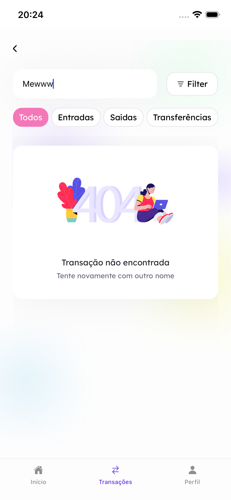
  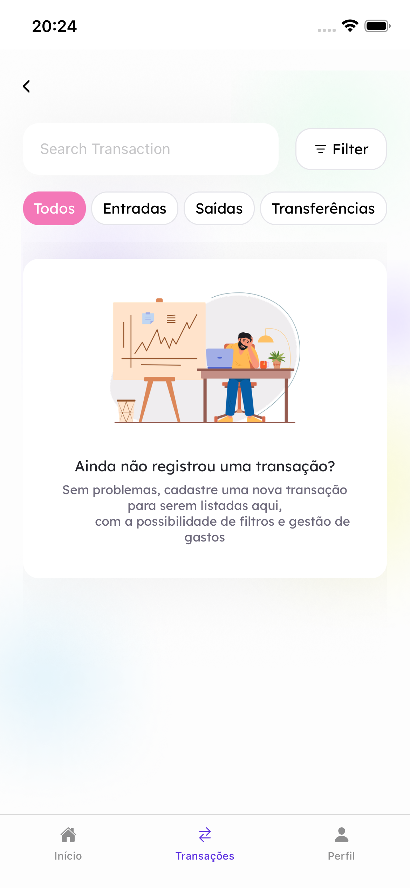
  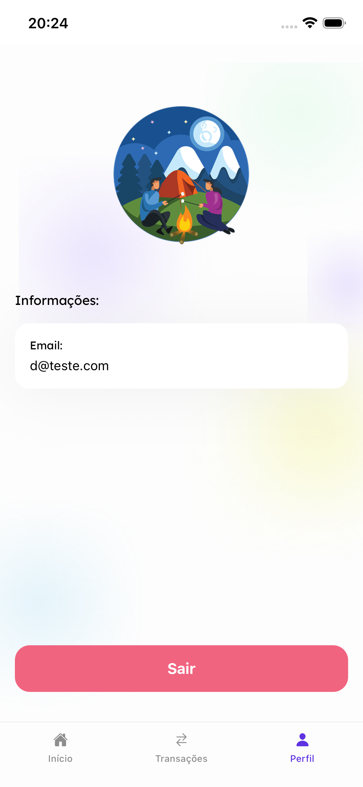
</div>

---
### Links:
- **Repo**: https://github.com/paoru5444/tech-challenge-fase-4
- **Figma**: https://www.figma.com/design/UcuHjUu120gHwTIFDZBrV5/Or%C3%A7amento-Simples?node-id=0-1&t=y2hudG4BATBZr4KK-1
---

## Como começar


1. Instale as dependências
```bash
   npm install
```

1. Faça um Pré Build
```bash
   npx expo prebuild --clean
```

2. Inicie o app com android
```bash
   npx expo run:android
```

2. Ou inicie o app com ios
```bash
   npx expo run:ios
```

2. Após fazer o build inicial, basta iniciar o expo
```bash
   npx expo start
```

Obs: As configurações do firebase já estão no projeto.


Na saída do terminal, você encontrará opções para abrir o app em:

- [Build de desenvolvimento](https://docs.expo.dev/develop/development-builds/introduction/)
- [Emulador Android](https://docs.expo.dev/workflow/android-studio-emulator/)
- [Simulador iOS](https://docs.expo.dev/workflow/ios-simulator/)
- [Expo Go](https://expo.dev/go), uma sandbox limitada para experimentar o desenvolvimento com Expo

Você pode começar a desenvolver editando os arquivos dentro do diretório **app**. Este projeto utiliza [roteamento baseado em arquivos](https://docs.expo.dev/router/introduction).

---

## Ferramentas

- React Native
- Typescript
- Expo
- Firebase
- Zod
- React Hook Form
- Formik
- Expo Router
- Expo Font
- React Native Calendars
- React Native Document Picker
- RxJS

---

## Arquitetura

O projeto foi construído com uma arquitetura **modular**, onde cada pasta dentro de `modules/` representa um módulo independente da aplicação, que contém uma estrutura de Clean Architecture.

### Estrutura dos módulos
```
src/
└── modules/
    └── <ModuleName>/
        ├── data
        ├────── remote/
        ├── domain
        ├────── entities/
        ├────── repositories/
        ├────── usecases/
        ├── presentation
        ├────── components/
        ├────── hooks/
        ├────── screens/
        ├── di
        ├────── container.ts
        ├── store
        ├────── actions.ts
        ├────── selectors.ts
        ├────── slices.ts
```

### Escalabilidade

Essa estrutura torna o projeto preparado para crescer, seja para a adição de **novas features** ou para a inclusão de **novos integrantes** na equipe de desenvolvimento, sem que a organização do código seja comprometida.

---

## Melhorias

- Expandir uso do RxJS pelo projeto
- Salvar os assets no S3 da AWS
- Adicionar mais animações e selecionar icones melhores
- Criar testes unitários visando 80% de coverage
- Criar em torno de 5 testes de integração para cenários criticos
- Adicionar ferramenta de Tracking e Monitoramento como o Sentry
- Subir a aplicação no Google Play e na App Store
- Adicionar EAS para OTA Updates
- Usar react-native-firebase

---

- Desenvolvido com o ❤️
